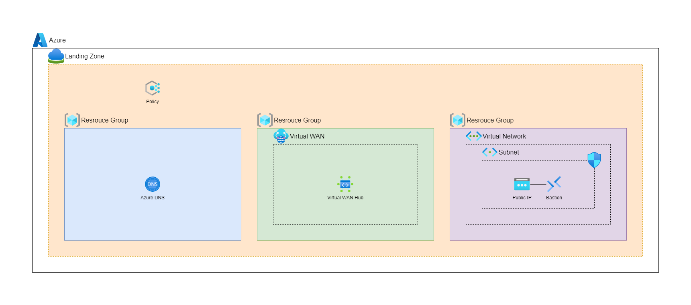

# ARMTemplate - LandingZone

## 概要

- 以下の Azure ポリシーとリソースグループをデプロイする
  - Azure ポリシー
    - Azure リソースをデプロイするリージョンを制限する Azure ポリシー
    - 指定したテナント ID の Azure テナントにのみ、Azure Lighthouse の権限委任を許可する Azure ポリシー
  - リソースグループ
    - Azure DNS を配置するリソースグループ
    - Virtual WAN、Virtual WAN ハブを配置するリソースグループ
    - Azure Bastion Host、仮想ネットワーク、サブネット、パブリック IP、ネットワークセキュリティグループを配置するリソースグループ

## 構成図

## デプロイ方法

1. 以下の[Deploy to Azure]ボタンを押下
2. 以下の各パラメータを指定
   - `サブスクリプション`：リソースのデプロイ先のサブスクリプションを指定
   - `List Of Allowed Locations Parameter`：リソースのデプロイ先として許可する Azure リージョンを指定
   - `List Of Allowed Tenants Parameter`：Lighthouse の権限委任を許可する Azure テナントのテナント ID を指定
   - `Resource Group Location`：リソースグループのデプロイ先のリージョンを指定(東日本:japaneast)
3. 内容に問題がなければ、[確認と作成]からデプロイを実行
 
