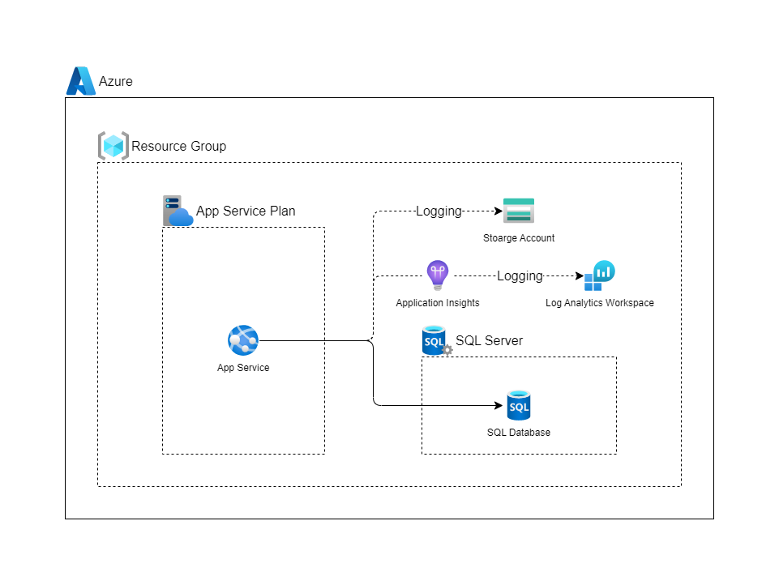

# ARMTemplate - SQLDatabaseApplication-Single

## 概要

- 以下のリソースをデプロイする
  - App Service Plan
  - App Service
  - Application Insights
  - Log Analytics ワークスペース
  - SQL Server
  - SQL Database

## 構成図

## デプロイ方法

1. 以下の[Deploy to Azure]ボタンを押下
2. 以下の各パラメータを指定
   - `サブスクリプション`：リソースのデプロイ先のサブスクリプションを指定
   - `リソースグループ`：リソースのデプロイ先のリソースグループを指定
   - `リージョン`：リソースのデプロイ先のリージョンを指定
   - `Environment`：環境名(本番：`pr`、ステージング：`st`、開発：`dv` 、検証：`ve` )
   - `Project Prefix`：プロジェクト名
   - `Location Name`：デプロイ先のリージョンの名前（東日本：japaneast）
   - `Location Code`：デプロイ先のリージョンの略称（東日本：je）
   - `Sku`：App Service Plan の SKU（Standard S1：S1）
   - `Administrator Login`：SQL Server の管理者ユーザ名
   - `Administrator Login Password`：SQL Server の管理者ユーザパスワード
   - `Database Name`：データベース名
   - `Collation`：SQL Database 照合順序
   - `Edition`：SQL Database のエディション(Basic, Standard, Premium)
   - `Max Size Bytes`：データベースの容量
   - `Requested Service Objective Name`：SQL Database の SKU
3. 内容に問題がなければ、[確認と作成]からデプロイを実行

